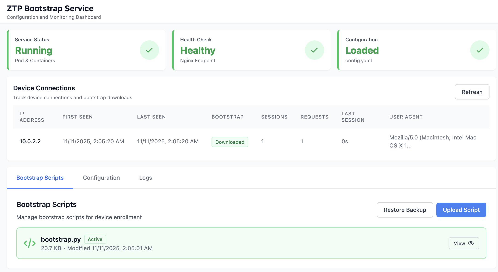

# Arista ZTP Bootstrap Service

A containerized service that provides a secure HTTPS endpoint for serving Arista Zero Touch Provisioning (ZTP) bootstrap scripts to network devices.

## Quick Start

### Prerequisites

- **Podman** installed (`podman --version`)
- **Macvlan network** created (run `./check-macvlan.sh` to verify)
- **Enrollment token** from CVaaS Device Registration page
- **SSL certificates** ready (or use HTTP-only mode for testing)
- **Root/sudo access** for setup

### Installation

**Recommended: Interactive Setup** (first-time users)

```bash
# Install yq if needed
# macOS: brew install yq
# Linux: sudo dnf install yq  # or apt-get install yq

# Run interactive setup
./setup-interactive.sh

# Follow prompts to configure everything
# Script will generate config.yaml and start the service
```

**Alternative: Automated Setup** (quick setup)

```bash
# 1. Create environment file
cp ztpbootstrap.env.template ztpbootstrap.env
# Edit ztpbootstrap.env and set ENROLLMENT_TOKEN

# 2. Run automated setup
sudo ./setup.sh

# For HTTP-only mode (testing only):
sudo ./setup.sh --http-only
```

### Verify Installation

```bash
# Check service status
sudo systemctl status ztpbootstrap-pod

# Test health endpoint
curl -k https://ztpboot.example.com/health

# Access Web UI
# Navigate to: https://ztpboot.example.com/ui/
```

---

## What This Does

When an Arista switch boots, it requests network configuration from a DHCP server. The DHCP server provides a URL to a bootstrap script (via DHCP Option 67). This service provides that bootstrap script endpoint, allowing switches to:

1. Download the bootstrap script (`bootstrap.py`) over HTTPS
2. Execute the script automatically
3. Enroll with Arista CloudVision (CVaaS) using an enrollment token
4. Receive their configuration from CVaaS

**Key Features:**
- ✅ Secure HTTPS serving with TLS 1.2/1.3
- ✅ Security headers (HSTS, CSP, X-Frame-Options, etc.)
- ✅ Containerized with Podman for easy deployment
- ✅ Systemd integration for automatic startup
- ✅ Health check endpoint for monitoring
- ✅ Web UI for management and monitoring
- ✅ Support for HTTP-only mode (lab/testing only)

### Web UI Dashboard

The service includes a web-based management interface for monitoring and configuration:



**Features:**
- Service status and health monitoring
- Device connection tracking
- Bootstrap script management
- Configuration viewing
- Service logs

Access the Web UI at: `https://ztpboot.example.com/ui/`

---

## Architecture

The service runs as a **Podman pod** with multiple containers:

- **Infra Container**: Pod infrastructure
- **Nginx Container**: Serves bootstrap script, handles HTTPS, proxies Web UI
- **Web UI Container**: Flask-based management interface (optional)
- **Macvlan Network**: Direct network access with dedicated IP
- **Systemd Integration**: Quadlet files for automatic service management

```
┌─────────────────┐
│  Arista Switch  │
│   (DHCP Client) │
└────────┬────────┘
         │
         │ 1. DHCP Request
         ▼
┌─────────────────┐
│  DHCP Server    │
│  (Provides URL) │
└────────┬────────┘
         │
         │ 2. DHCP Response
         │    DHCP Option 67: https://ztpboot.example.com/bootstrap.py
         ▼
┌─────────────────┐
│  ZTP Bootstrap  │
│     Service     │
│  (This Service) │
└────────┬────────┘
         │
         │ 3. HTTPS Request
         ▼
┌─────────────────┐
│  Nginx Container│
│  (Serves Script)│
└────────┬────────┘
         │
         │ 4. Script Download
         ▼
┌─────────────────┐
│  Arista Switch  │
│  (Executes)     │
└────────┬────────┘
         │
         │ 5. CVaaS Enrollment
         ▼
┌─────────────────┐
│  Arista CVaaS   │
│  (Configuration)│
└─────────────────┘
```

---

## Setup Methods

### Interactive Setup (Recommended)

Guided setup with prompts for all configuration. Generates `config.yaml` for centralized configuration.

```bash
./setup-interactive.sh
```

**Benefits:**
- No manual file editing
- Centralized YAML configuration
- Detects and upgrades existing installations
- Creates backups automatically

See [Interactive Setup Details](#interactive-setup) for more information.

### Automated Setup

Quick setup using environment variables. Good for repeat deployments.

```bash
# Configure ztpbootstrap.env first
sudo ./setup.sh
```

See [Automated Setup Details](#automated-setup) for more information.

---

## Service Management

### Start/Stop/Restart

```bash
# Start
sudo systemctl start ztpbootstrap-pod

# Stop
sudo systemctl stop ztpbootstrap-pod

# Restart
sudo systemctl restart ztpbootstrap-pod

# Status
sudo systemctl status ztpbootstrap-pod

# Enable on boot
sudo systemctl enable ztpbootstrap-pod
```

### View Logs

```bash
# Container logs
sudo podman logs ztpbootstrap-nginx
sudo podman logs ztpbootstrap-webui

# Systemd logs
sudo journalctl -u ztpbootstrap-pod -f
sudo journalctl -u ztpbootstrap-nginx -f
sudo journalctl -u ztpbootstrap-webui -f
```

---

## Configuration

### Interactive Setup Configuration

The interactive setup stores all configuration in `config.yaml`:

```yaml
paths:
  script_dir: "/opt/containerdata/ztpbootstrap"
  cert_dir: "/opt/containerdata/certs/wild"

network:
  domain: "ztpboot.example.com"
  ipv4: "10.0.0.10"
  ipv6: "2001:db8::10"

cvaas:
  address: "www.arista.io"
  enrollment_token: "your_token_here"
```

See `config.yaml.template` for complete structure.

### Automated Setup Configuration

Edit `ztpbootstrap.env`:

```bash
CV_ADDR=www.arista.io
ENROLLMENT_TOKEN=your_token_here
NTP_SERVER=pool.ntp.org
TZ=UTC
```

---

## DHCP Configuration

Configure your DHCP server to provide the bootstrap script URL via DHCP Option 67:

**ISC DHCP:**
```dhcp
subnet 10.0.0.0 netmask 255.255.255.0 {
    range 10.0.0.100 10.0.0.200;
    option routers 10.0.0.1;
    option bootfile-name "https://ztpboot.example.com/bootstrap.py";
}
```

**Kea DHCP:**
```json
{
  "option-data": [
    {
      "name": "boot-file-name",
      "data": "https://ztpboot.example.com/bootstrap.py"
    }
  ]
}
```

---

## Testing

```bash
# Quick validation
./ci-test.sh

# Integration test (HTTP-only mode)
sudo ./integration-test.sh --http-only

# Service validation
sudo /opt/containerdata/ztpbootstrap/test-service.sh
```

See [TESTING.md](TESTING.md) for complete testing documentation.

---

## Troubleshooting

**Service won't start?**
```bash
sudo journalctl -u ztpbootstrap-pod -n 50
sudo podman logs ztpbootstrap-nginx
```

**Can't access bootstrap script?**
```bash
curl -k https://ztpboot.example.com/bootstrap.py
curl -k https://ztpboot.example.com/health
```

**SSL certificate issues?**
```bash
ls -la /opt/containerdata/certs/wild/
openssl x509 -in /opt/containerdata/certs/wild/fullchain.pem -text -noout
```

See [TROUBLESHOOTING.md](TROUBLESHOOTING.md) for detailed troubleshooting guide.

---

## Documentation

- **[QUICK_START.md](QUICK_START.md)** - Step-by-step installation guide
- **[TROUBLESHOOTING.md](TROUBLESHOOTING.md)** - Common issues and solutions
- **[TESTING.md](TESTING.md)** - Testing procedures and scripts
- **[DEVELOPMENT.md](DEVELOPMENT.md)** - Development workflow and testing
- **[KNOWN_ISSUES.md](KNOWN_ISSUES.md)** - Known issues and implementation notes
- **[ARCHITECTURE_COMPARISON.md](ARCHITECTURE_COMPARISON.md)** - Architecture details

---

## Platform Support

**Tested Platforms:**
- **Architecture:** ARM64 (aarch64) - ✅ Fully tested
- **OS:** Fedora 43 Cloud - ✅ Fully tested and recommended
- **Podman:** 5.6.2 - ✅ Fully tested
- **Systemd:** Full quadlet support - ✅ Fully tested

**Notes:**
- x86_64 not tested on ARM64 macOS (would require emulation). See [ARCHITECTURE_COMPARISON.md](ARCHITECTURE_COMPARISON.md) for details.
- **Ubuntu has known SSH/cloud-init issues** and is not fully supported. See [KNOWN_ISSUES.md](KNOWN_ISSUES.md) for details.

---

## Support

For issues related to:
- **Arista ZTP**: Check [Arista Documentation](https://www.arista.com/en/support/documentation)
- **CVaaS**: Contact Arista Support or check [CVaaS Documentation](https://www.arista.com/en/products/eos/eos-cloudvision)
- **This Service**: See [TROUBLESHOOTING.md](TROUBLESHOOTING.md) or [GitHub Issues](https://github.com/coreyhines/ztpbootstrap/issues)

---

## License

This service uses the Arista bootstrap script which is governed by the Apache License 2.0.
