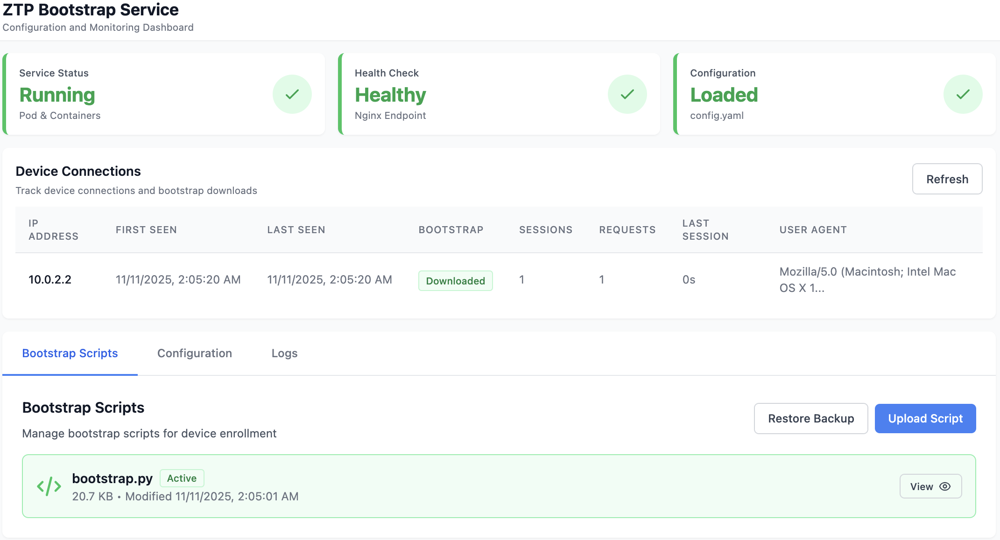

# Arista ZTP Bootstrap Service

A containerized service that provides a secure HTTPS endpoint for serving Arista Zero Touch Provisioning (ZTP) bootstrap scripts to network devices.



## Documentation

**Getting Started:**
- **[docs/QUICK_START.md](docs/QUICK_START.md)** - Complete step-by-step installation guide (start here!)
- **[docs/TROUBLESHOOTING.md](docs/TROUBLESHOOTING.md)** - Common issues and solutions
- **[docs/TESTING.md](docs/TESTING.md)** - Testing procedures and validation scripts
- **[docs/SECURITY.md](docs/SECURITY.md)** - Security features, authentication, and security testing

**For Developers:**
- **[docs/DEVELOPMENT.md](docs/DEVELOPMENT.md)** - Development workflow, VM testing, and upgrade scenarios
- **[docs/ARCHITECTURE_COMPARISON.md](docs/ARCHITECTURE_COMPARISON.md)** - Detailed architecture and design decisions
- **[docs/KNOWN_ISSUES.md](docs/KNOWN_ISSUES.md)** - Known issues and implementation notes

## Quick Start

**Prerequisites:** Podman (tested with 4.9.3 on Ubuntu 24.04, 5.6.2 on Fedora 43), enrollment token from CVaaS, SSL certificates (or HTTP-only mode for testing)

```bash
# Clone repository
git clone https://github.com/coreyhines/ztpbootstrap.git
cd ztpbootstrap

# Run interactive setup (recommended)
./setup-interactive.sh

# Or use automated setup
sudo ./setup.sh
```

**📖 For detailed installation instructions, see [docs/QUICK_START.md](docs/QUICK_START.md)**

---

## What This Does

When an Arista switch boots, it requests network configuration from a DHCP server. The DHCP server provides a URL to a bootstrap script (via DHCP Option 67). This service provides that bootstrap script endpoint, allowing switches to:

1. Download the bootstrap script (`bootstrap.py`) over HTTPS
2. Execute the script automatically
3. Enroll with Arista CloudVision (CVaaS) using an enrollment token
4. Receive their configuration from CVaaS

**Key Features:**
- ✅ Secure HTTPS serving with TLS 1.2/1.3
- ✅ Security headers (HSTS, CSP, X-Frame-Options, etc.)
- ✅ Containerized with Podman for easy deployment
- ✅ Systemd integration for automatic startup
- ✅ Health check endpoint for monitoring
- ✅ Web UI for management and monitoring with authentication
- ✅ Support for HTTP-only mode (lab/testing only)

### Web UI Dashboard

The service includes a web-based management interface for monitoring and configuration with features for service status, device connection tracking, bootstrap script management, configuration viewing, and service logs.

**Authentication:** Write operations (upload scripts, delete, rename, restore backups, mark logs, view configuration) require authentication. Read-only operations (viewing status, scripts, logs, device connections) are accessible without authentication. The admin password is required and must be set during initial setup via `setup-interactive.sh`, or will be loaded from an existing `config.yaml` when upgrading.

Access the Web UI at: `https://ztpboot.example.com/ui/`

---

## Architecture

The service runs as a **Podman pod** with multiple containers:

- **Infra Container**: Pod infrastructure
- **Nginx Container**: Serves bootstrap script, handles HTTPS, proxies Web UI
- **Web UI Container**: Flask-based management interface (optional)
- **Network**: Macvlan (dedicated IP) or host networking (shared host network)
- **Systemd Integration**: Quadlet files for automatic service management

**📖 For detailed architecture information, see [docs/ARCHITECTURE_COMPARISON.md](docs/ARCHITECTURE_COMPARISON.md)**

```
┌─────────────────────────────────────────────────────────────┐
│                    Arista Switch                            │
│                   (DHCP Client)                             │
└───────────────┬─────────────────────────────────────────────┘
                │
                │ 1. DHCP Request
                ▼
┌─────────────────────────────────────────────────────────────┐
│                    DHCP Server                              │
│                  (Provides URL)                             │
└───────────────┬─────────────────────────────────────────────┘
                │
                │ 2. DHCP Response
                │    DHCP Option 67: https://ztpboot.example.com/bootstrap.py
                ▼
┌─────────────────────────────────────────────────────────────┐
│              ZTP Bootstrap Service                          │
│                  (This Service)                             │
│                                                             │
│  ┌───────────────────────────────────────────────────────┐ │
│  │              Podman Pod                               │ │
│  │                                                       │ │
│  │  ┌──────────────────┐  ┌──────────────────────────┐ │ │
│  │  │  Nginx Container │  │   Web UI Container       │ │ │
│  │  │                  │  │   (Flask Application)    │ │ │
│  │  │  • Serves Script │  │   • Management UI        │ │ │
│  │  │  • HTTPS/TLS     │  │   • Status Monitoring    │ │ │
│  │  │  • Proxies /ui/  │  │   • Device Tracking      │ │ │
│  │  └────────┬─────────┘  └──────────────────────────┘ │ │
│  │           │                                           │ │
│  │           │ 3. HTTPS Request                          │ │
│  │           │    (via Nginx)                            │ │
│  └───────────┼───────────────────────────────────────────┘ │
└───────────────┼─────────────────────────────────────────────┘
                │
                │ 4. Script Download
                ▼
┌─────────────────────────────────────────────────────────────┐
│                    Arista Switch                            │
│                    (Executes)                               │
└───────────────┬─────────────────────────────────────────────┘
                │
                │ 5. CVaaS Enrollment
                ▼
┌─────────────────────────────────────────────────────────────┐
│                    Arista CVaaS                             │
│                  (Configuration)                            │
└─────────────────────────────────────────────────────────────┘
```

---

## Setup Methods

**Interactive Setup** (Recommended for first-time users)
- Guided prompts for all configuration
- Generates `config.yaml` for centralized configuration
- Detects and upgrades existing installations
- Creates backups automatically

```bash
./setup-interactive.sh
```

**Upgrade Existing Installation** (Non-interactive upgrade)
- Automatically creates backup before upgrade
- Preserves all previous configuration values
- Requires existing installation to be present
- Runs non-interactively (no prompts)

```bash
./setup-interactive.sh --upgrade
```

**Automated Setup** (Quick setup for repeat deployments)
- Uses environment variables from `ztpbootstrap.env`
- Good for automation and repeat deployments

```bash
sudo ./setup.sh
```

**📖 For detailed setup instructions, see [QUICK_START.md](QUICK_START.md)**

---

## Service Management

### Start/Stop/Restart

```bash
# Start
sudo systemctl start ztpbootstrap

# Stop
sudo systemctl stop ztpbootstrap

# Restart
sudo systemctl restart ztpbootstrap

# Status
sudo systemctl status ztpbootstrap

# Enable on boot
sudo systemctl enable ztpbootstrap
```

### View Logs

```bash
# Container logs
sudo podman logs ztpbootstrap-nginx
sudo podman logs ztpbootstrap-webui

# Systemd logs
sudo journalctl -u ztpbootstrap -f
sudo journalctl -u ztpbootstrap-nginx -f
sudo journalctl -u ztpbootstrap-webui -f
```

---

## Configuration

### Interactive Setup Configuration

The interactive setup stores all configuration in `config.yaml`:

```yaml
paths:
  script_dir: "/opt/containerdata/ztpbootstrap"
  cert_dir: "/opt/containerdata/certs/wild"

network:
  domain: "ztpboot.example.com"
  ipv4: "10.0.0.10"
  ipv6: "2001:db8::10"

cvaas:
  address: "www.arista.io"
  enrollment_token: "your_token_here"
```

See `config.yaml.template` for complete structure.

### Automated Setup Configuration

Edit `ztpbootstrap.env`:

```bash
CV_ADDR=www.arista.io
ENROLLMENT_TOKEN=your_token_here
NTP_SERVER=pool.ntp.org
TZ=UTC
```

---

## DHCP Configuration

Configure your DHCP server to provide the bootstrap script URL via DHCP Option 67:

**ISC DHCP:**
```dhcp
subnet 10.0.0.0 netmask 255.255.255.0 {
    range 10.0.0.100 10.0.0.200;
    option routers 10.0.0.1;
    option bootfile-name "https://ztpboot.example.com/bootstrap.py";
}
```

**Kea DHCP:**
```json
{
  "option-data": [
    {
      "name": "boot-file-name",
      "data": "https://ztpboot.example.com/bootstrap.py"
    }
  ]
}
```

---

## Testing

```bash
# Quick validation
./ci-test.sh

# Integration test (HTTP-only mode)
sudo ./integration-test.sh --http-only

# Service validation
sudo /opt/containerdata/ztpbootstrap/test-service.sh
```

**📖 For complete testing documentation, see [TESTING.md](TESTING.md)**

---

## Troubleshooting

**Quick checks:**
```bash
# Service status
sudo systemctl status ztpbootstrap

# Container logs
sudo podman logs ztpbootstrap-nginx

# Health check
curl -k https://ztpboot.example.com/health
```

**📖 For detailed troubleshooting guide, see [docs/TROUBLESHOOTING.md](docs/TROUBLESHOOTING.md)**

---

## Tested Platforms

**Tested Configurations:**
- **Architecture:** ARM64 (aarch64) - ✅ Tested and working
- **OS:**
  - **Fedora 43** (ARM64) - ✅ Tested and working
    - RedHat/RPM-based, `dnf` package manager
    - Podman 5.6.2 (default in Fedora 43)
  - **Ubuntu 24.04** (ARM64) - ✅ Tested and working
    - Debian/APT-based, `apt` package manager
    - Podman 4.9.3 (default in Ubuntu 24.04)
- **Podman:** Tested with 4.9.3 (Ubuntu 24.04) and 5.6.2 (Fedora 43)
- **Systemd:** Full quadlet support - ✅ Tested and working

**Choosing Between Tested Paths:**
- **Fedora 43**: RedHat/RPM-based, SELinux environments, Podman 5.6.2
- **Ubuntu 24.04**: Debian/APT-based, AppArmor environments, Podman 4.9.3, LTS support

**Note:** These are tested configurations. Other distributions or Podman versions may work but have not been verified.

**Notes:**
- x86_64 not tested on ARM64 macOS (would require emulation). See [docs/ARCHITECTURE_COMPARISON.md](docs/ARCHITECTURE_COMPARISON.md) for details.
- Ubuntu 22.04 may have SSH/cloud-init issues in VM creation workflows. Ubuntu 24.04+ recommended. See [docs/KNOWN_ISSUES.md](docs/KNOWN_ISSUES.md) for details.

**Network Configuration:**
- **Macvlan network** (recommended for production) - Provides dedicated IP address, isolates containers from host network. Run `./check-macvlan.sh` to verify or create.
- **Host networking** (simpler, good for testing) - Containers share host's network stack, uses host IP addresses directly.

---

## Support

**Need help?**
- **This Service**: See [docs/TROUBLESHOOTING.md](docs/TROUBLESHOOTING.md) or [GitHub Issues](https://github.com/coreyhines/ztpbootstrap/issues)
- **Arista ZTP**: Check [Arista Documentation](https://www.arista.com/en/support/documentation)
- **CVaaS**: Contact Arista Support or check [CVaaS Documentation](https://www.arista.com/en/products/eos/eos-cloudvision)

---

## License

This service uses the Arista bootstrap script which is governed by the Apache License 2.0.
