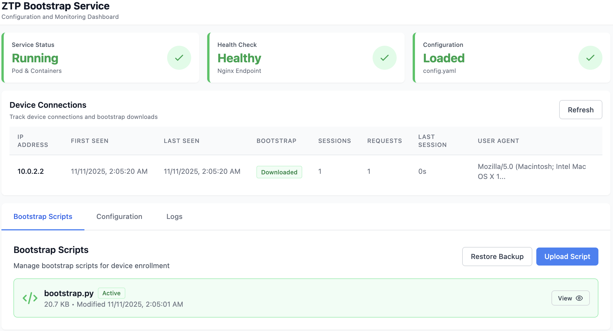

# Arista ZTP Bootstrap Service

Containerized HTTPS endpoint for Arista Zero Touch Provisioning (ZTP) bootstrap scripts, with an optional Web UI and optional built-in Kea DHCP server.



## Features

- Serves `bootstrap.py` over HTTPS (TLS 1.2/1.3) or HTTP-only for lab use
- Web UI for status, logs, script management, and optional DHCP configuration
- Optional **Kea DHCP** with reservations, OUI filtering, and DHCP Option 67 for ZTP URLs
- Podman pod + systemd quadlets for install, upgrades, and boot persistence
- Health check endpoint and security headers (HSTS, CSP, X-Frame-Options, etc.)

## How it works

1. A switch boots and requests DHCP (from your existing server, or the optional Kea service).
2. DHCP Option 67 points the switch at `https://<host>/bootstrap.py`.
3. The switch downloads and runs the script, then enrolls with Arista CloudVision (CVaaS).

```
Switch ──DHCP──► DHCP server (external or built-in Kea)
  │
  └──HTTPS──► Nginx ──► bootstrap.py ──► CVaaS enrollment
                    └──► Web UI (/ui/)
```

## Quick start

**Lab (fastest):** host networking + HTTP-only — no macvlan or certificates. See [docs/QUICK_START.md](docs/QUICK_START.md#lab-quickstart-5-minutes-no-macvlan-required).

**Production:** macvlan or host networking with TLS certificates and a CVaaS enrollment token.

```bash
git clone https://github.com/coreyhines/ztpbootstrap.git
cd ztpbootstrap
./setup-interactive.sh          # guided install (recommended)
# sudo ./setup.sh               # non-interactive; uses ztpbootstrap.env
```

After install:

```bash
sudo systemctl status ztpbootstrap
curl -k https://ztpboot.example.com/health    # or http://<host-ip>/health in lab mode
```

**Upgrade an existing install:**

```bash
git pull origin main
sudo ./setup-interactive.sh --upgrade
```

Full walkthrough: **[docs/QUICK_START.md](docs/QUICK_START.md)**

## Requirements

| | |
|---|---|
| **Runtime** | Rootful Podman ≥ 4.9 + systemd (quadlets). **Docker is not supported.** |
| **Tested OS** | Fedora 43, Ubuntu 24.04 (ARM64) |
| **Network** | macvlan (production) or host networking (lab) |
| **Secrets** | CVaaS enrollment token; Web UI admin password (set during setup) |

Image tags are pinned in [`versions.env`](versions.env). Registry paths like `docker.io/nginx:…` are OCI image references — they do not use the Docker engine.

Airgapped installs: pre-pull images with `podman save` / `podman load`. See [docs/QUICK_START.md](docs/QUICK_START.md#airgapped--offline-install).

## Documentation

| Topic | Guide |
|-------|-------|
| Installation & upgrades | [docs/QUICK_START.md](docs/QUICK_START.md) |
| Troubleshooting | [docs/TROUBLESHOOTING.md](docs/TROUBLESHOOTING.md) |
| Testing | [docs/TESTING.md](docs/TESTING.md) |
| Optional DHCP server | [dhcp/README.md](dhcp/README.md), [docs/DHCP_TESTING.md](docs/DHCP_TESTING.md) |
| Architecture | [docs/ARCHITECTURE_COMPARISON.md](docs/ARCHITECTURE_COMPARISON.md) |
| Development & VM workflow | [CONTRIBUTING.md](CONTRIBUTING.md), [docs/DEVELOPMENT.md](docs/DEVELOPMENT.md) |
| Known issues | [docs/KNOWN_ISSUES.md](docs/KNOWN_ISSUES.md) |

## Service management

```bash
sudo systemctl start|stop|restart|status ztpbootstrap
sudo journalctl -u ztpbootstrap -f
sudo podman logs ztpbootstrap-nginx
sudo podman logs ztpbootstrap-webui
```

When DHCP is enabled via the Web UI, also check `ztpbootstrap-dhcp` and `ztpbootstrap-postgresql`.

Web UI: `https://<domain>/ui/` — write operations require the admin password set during setup.

## Configuration

- **`config.yaml`** — primary config (generated by `setup-interactive.sh`). See [`config.yaml.template`](config.yaml.template).
- **`ztpbootstrap.env`** — environment variables for automated `setup.sh`.
- **`.env`** — optional secrets (e.g. database password for Kea/PostgreSQL).

Utility scripts:

| Script | Purpose |
|--------|---------|
| `./check-macvlan.sh` | Verify or create the macvlan network |
| `./validate-config.sh` | Validate `config.yaml` |
| `./update-config.sh` | Apply config changes and restart services |
| `./config-diff.sh` | Compare config against a backup |

## DHCP

You can use any DHCP server that sets **Option 67** (`boot-file-name`) to your bootstrap URL:

```
option bootfile-name "https://ztpboot.example.com/bootstrap.py";
```

Or enable the **built-in Kea DHCP server** from the Web UI (**DHCP Server** app). Configuration files live in [`dhcp/`](dhcp/); leases can use PostgreSQL for persistence.

## Development & testing

```bash
make help              # list targets
make check             # lint + unit tests + CI checks
make test-ci           # file/syntax validation
make test-unit         # BATS + Python unit tests
make test-integration  # integration tests (requires running service)
```

Test scripts live under `dev/tests/` (for example `dev/tests/ci-test.sh`, `dev/tests/integration-test.sh`). See [docs/TESTING.md](docs/TESTING.md) and [docs/CI_TESTING.md](docs/CI_TESTING.md).

Local Web UI development:

```bash
mkdir -p /tmp/ztpbootstrap-dev/logs /tmp/ztpbootstrap-dev/scripts
cp bootstrap.py nginx.conf config.yaml.template /tmp/ztpbootstrap-dev/
cp /tmp/ztpbootstrap-dev/config.yaml.template /tmp/ztpbootstrap-dev/config.yaml
cd webui && ZTP_CONFIG_DIR=/tmp/ztpbootstrap-dev python3 -m flask run --host=0.0.0.0 --port=5000
```

See [AGENTS.md](AGENTS.md) for agent/CI development notes.

## Support

- **This project:** [docs/TROUBLESHOOTING.md](docs/TROUBLESHOOTING.md) · [GitHub Issues](https://github.com/coreyhines/ztpbootstrap/issues)
- **Arista ZTP / CVaaS:** [Arista documentation](https://www.arista.com/en/support/documentation)

## License

The Arista bootstrap script (`bootstrap.py`) is governed by the Apache License 2.0.
